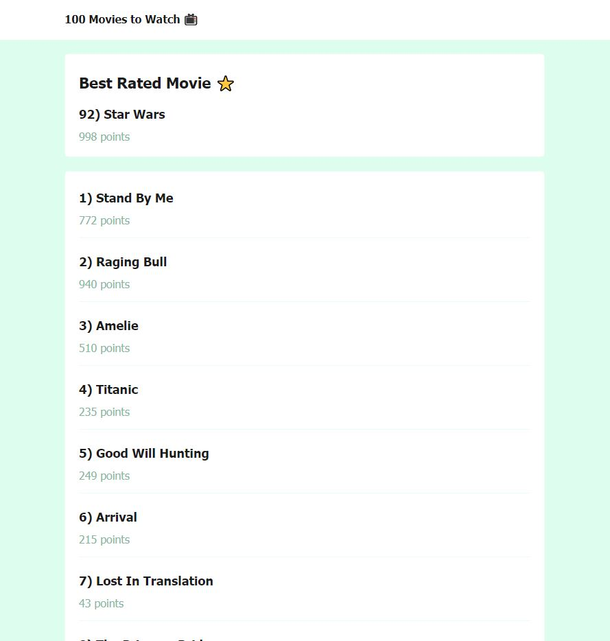
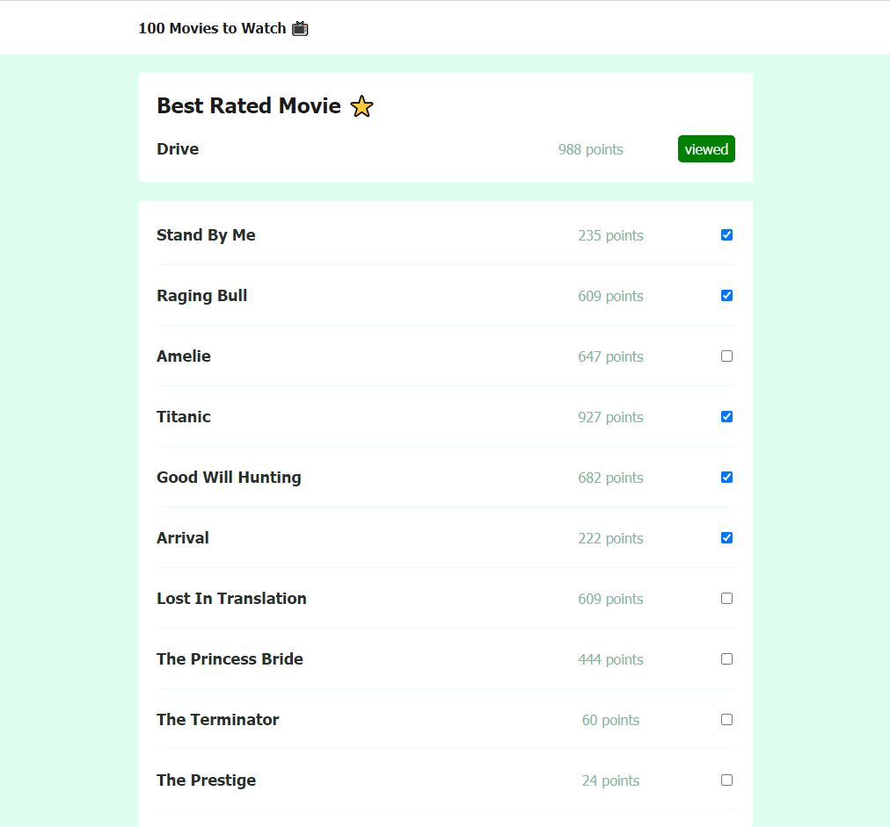

# 100 Movie to Watch

Es una aplicación sencilla en Javascript para practicar algunos conceptos básico, sobre arreglos, manejo del DOM y más.+

## Que aprenderas?

- Uso del DOM
- Uso de Arreglos en JavaScript
- Refactorizar código
- Metodos de Arreglos

## Uso

Descarga el proyecto inicial con Git usando el comando `git clone https://github.com/cristhianjhlweb/100-movies-to-watch.git` en la carpeta donde tengas tus proyectos. Y descargar la rama **feature/initial** donde estara todo el código fuente inicial del proyecto.

Se te descargara un proyecto inicial con un index.html con la lista de las peliculas para ver, una carpeta con los estilos y una carpeta con js donde trabajaremos todos nuestros scripts.

Para empezar a trabajar en el proyecto te recomiendo crear una rama nueva llamada **feature/nivel-uno-mi-solucion** con el siguiente comando `git checkout -b EL_NOMBRE_DE_TU_RAMA` aquí puedes empezar a escribir tu propio código.

Vas a encontrar la solución de este primer nivel en la rama **feature/nivel-uno-solucion** igual te recomiendo aunque sea dedicarle 30 minutos a intentar solucionarlo por tu cuenta, esto te ayudara a mejorar tu nivel como desarrollador.

## Que haremos?

### Nivel 1

- [x] Encontrar la pélicula con más puntos y mostrarla en la etiqueta section con el id largest-movie.
- [x] Agregar a esta etiqueta section el nombre y el punto de la pelicula con el punto más alto.

Para esto debes utilizar las herramientas que te ofrecer javascript. Ya sea con la manipulación de arreglos, del DOM, selectores y más.

### Nivel 1 Solución

Puedes encontra la solución en la rama **feature/nivel-uno-solucion** solo has un `git checkout -b feature/nivel-uno-solucion`

Puedes ver el video donde desarrolle el código en vivo en mi canal de youtube [100 Movies to Watch Lvl1](https://www.youtube.com/watch?v=w_WhgTVfOes)

### Nivel 2

- [x] Crear nuestro proyecto con npm
- [x] Configurar el tsconfig.json
- [x] Mover nuestros archivos estaticos (html, css) a nuestra carpeta public
- [x] Crear una carpeta src donde manejaremos todo nuestro código fuente en typescript
- [x] Crear un archivo movies.ts donde tendremos la data de las peliculas en un arreglo de objectos
- [x] Crear un archivo movie.ts donde crearemos una clase que se encargara de manejar toda la lógica que vimos en el nivel 1
- [x] Crear un archivo localstorage.ts donde manejaremos la persistencia de la data en el localstorage
- [x] Crear un archivo main.ts donde se inicializara el proyecto
- [x] Crear un archivo ui.ts que se encargara de la manipulación del DOM

En este nivel refactorizaremos todo nuestro proyecto de nivel 1, usando typescript que nos permitira tipar nuestro código lo que nos permite tener un desarrollo más seguro y mejor.

### Nivel 2 Solución

Puedes encontra la solución en la rama **feature/nivel-dos-solucion** solo has un `git checkout -b feature/nivel-dos-solucion`

## Recursos

- Array Methods [.forEach](https://developer.mozilla.org/es/docs/Web/JavaScript/Reference/Global_Objects/Array/forEach)
- Capturar los elementos del DOM [.querySelector](https://developer.mozilla.org/es/docs/Web/API/Document/querySelector)
- Metodo de Strings para separación de la cadena [.split](https://developer.mozilla.org/es/docs/Web/JavaScript/Reference/Global_Objects/String/split)
- Crear elementos HTML en el DOM [.createElement](https://developer.mozilla.org/es/docs/Web/API/Document/createElement)
- Agregar elemento HTML creado a su componente padre [.appendChild](https://developer.mozilla.org/es/docs/Web/API/Node/appendChild)
- Encontrar el index de un elemento en un array por su valor [.indexOf](https://developer.mozilla.org/es/docs/web/javascript/reference/global_objects/array/indexof)
- Obtener el valor maximo en un arreglo de números [Math.max](https://developer.mozilla.org/es/docs/Web/JavaScript/Reference/Global_Objects/Math/max)
- Que es TypeScript [TypeScript](https://www.typescriptlang.org/)
  - Classes
  - Types
  - Interfaces

## Pantallas del proyecto

## Se parte de mi comunidad

Puedes seguirme en cualquiera de mis redes sociales para que estes al tanto de todo lo que suba.

- 🕊 [Twitter.com](https://twitter.com/cristhianjhlweb)
- 📘 [LinkedIn.com](https://www.linkedin.com/in/cristhianjhl/)
- 🦝 [GitHub.com](https://github.com/cristhianjhlweb)
- 📹 [YouTube.com](https://www.youtube.com/channel/UCHAghHz0ytlb7OthFRJRg7Q)
- 🌐 [Cristhianjhl.com](https://cristhianjhl.com?utm_source=github&utm_medium=referrer&utm_campaign=100-movies-to-watch)

Hice este proyecto en vivo transmitiendo por 📺 [Twitch.tv](https://twitch.tv/cristhianjhlweb)
